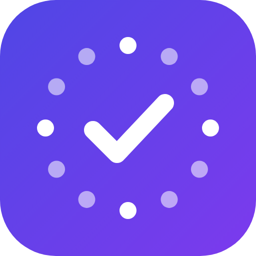

<p align="center"></p>

# TestPact

Android developers team up in groups of up to 20 and test each other's apps for 16 days to pass Google Play's **12 testers × 14 days** closed-testing requirement. Installs and daily usage are verified on the device, and a trust score keeps everyone honest.

**Setup & publishing:** [docs/SETUP.md](docs/SETUP.md) · **Play Store listing & data safety:** [docs/PLAY_STORE.md](docs/PLAY_STORE.md)

## Flow

```
Sign in (Google) → Onboarding (+ Usage access) → Add app (package + opt-in link)
→ Join queue ──(20 people in tier, or ≥14 after 48h wait)──▶ Group formed
→ SETUP 48h: copy all emails → paste in Play Console → "I added everyone"
             join + install every visible app (verified on-device)
   (no-shows removed & refilled from the queue; up to 3 extra 24h rounds; <14 → cancelled, ready members re-queued first)
→ ACTIVE 16 days: open each app daily (Open button + Usage Access), give feedback
   daily 00:20 UTC check: ≥90% of apps opened = good day (+1) else missed (−5)
   1 miss → warning, 2 → final warning (visible to group), 3 → auto-removed + strike (−30)
   refills allowed on days 1–2 if fewer than 15 members are left
→ COMPLETE: +10 trust, badges → apply for production in Play Console
```

**Fairness:**
- **Give first.** Your app is only listed for others after you confirm you added their emails.
- **Data beats votes.** Reports from max(3, 25% of the group) members within 48h suspend someone *only if* their usage data also looks bad. Otherwise the reports are dismissed automatically.
- **Admin review** confirms (kick, strike, −45 trust) or rejects (reinstate, −3 per false reporter).
- **Trust score** starts at 50. Starter tier is for users with no completed group or a score under 60; trusted tier is everyone else. Higher trust moves you up the queue.
- **3 strikes** blocks joining new groups. Appeals are reviewed by the admin.
- **One account per device** (hashed Android ID), with optional **Play Integrity** enforcement.

## Tech

| Part | Stack |
|---|---|
| App | Flutter 3.47, Riverpod 3, go_router, Material 3, 6 languages (en, hi, gu, mr, es, pt) |
| Native | `packages/device_bridge`: Kotlin plugin for install checks, UsageStatsManager events, app launch, ANDROID_ID, Play Integrity. Works in WorkManager background engines too |
| Backend | Firebase Auth (Google), Firestore, Storage, FCM, Hosting, Cloud Functions v2 (TypeScript, `asia-south1`) |
| Jobs | `matchQueue` every 15 min · `hourly` (setup deadlines, reminders) · `daily` 00:20 UTC (evaluate, warn, kick, refill, complete) · `dailyReminder` 14:00 UTC |

```
lib/src/            app (screens/, services/, models.dart, providers.dart, router.dart)
lib/l10n/           generated ARB files (edit tool/strings_*.py, then: python3 tool/gen_arb.py)
packages/device_bridge/  native Android plugin
functions/src/      Cloud Functions (config.ts has every rule/threshold)
firestore.rules, storage.rules, firestore.indexes.json
web/                privacy, terms, delete-account pages (Firebase Hosting)
scripts/            create_keystore.sh, setup_firebase.sh
```

## Develop

```bash
flutter pub get && flutter analyze && flutter test
cd functions && npm ci && npm test
```
